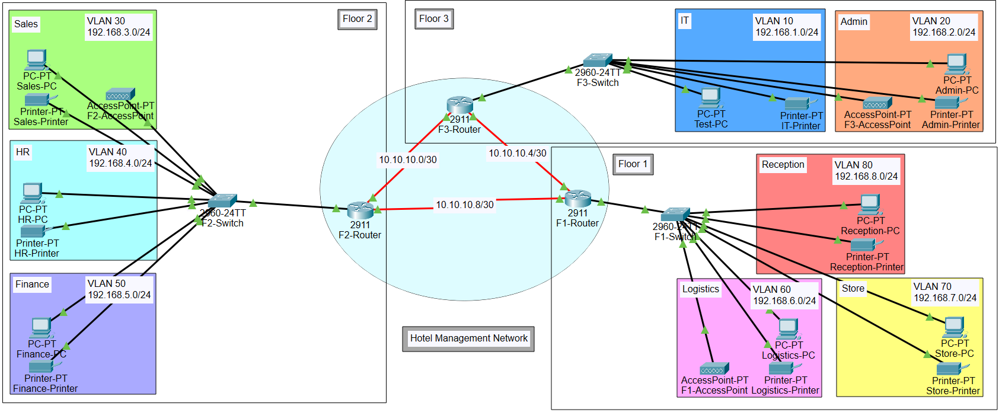
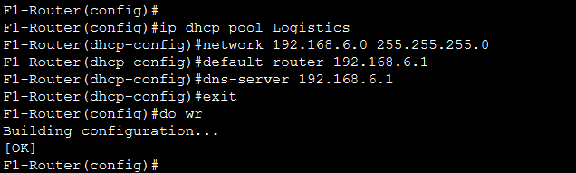
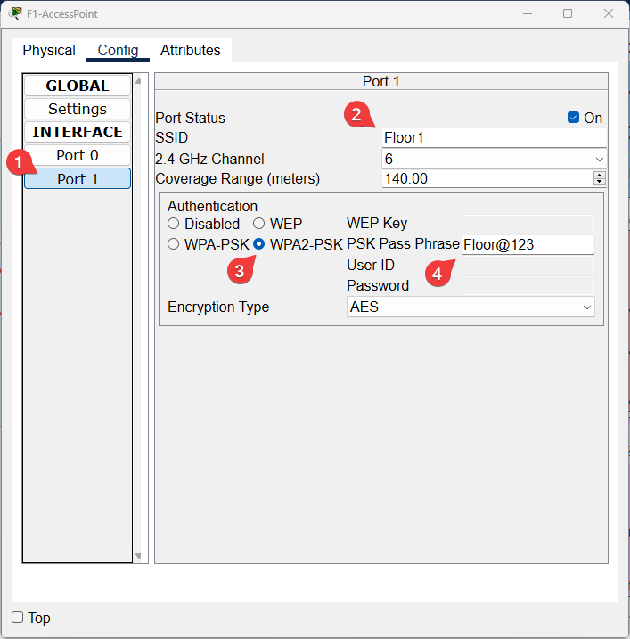

# Build a Virtual Network

## Project Description

Over the past few months, I have learned about networking terminology, protocols, and concepts. However, I have not had much practical hands-on experience with networking. To gain more hands-on networking skills, I will be documenting my progress in building a hotel network in Cisco Packet Tracer.  

Thanks to [Bernard Otom](https://www.youtube.com/@benardotom) for providing the project and walkthrough on his YouTube channel.

**Table of Contents**

- [Build a Virtual Network](#build-a-virtual-network)
   * [Project Description](#project-description)
      + [Network Requirements](#network-requirements)
   * [Design](#design)
      + [Routers](#routers)
      + [Switches, Wi-fi, PCs, and Printers](#switches-wi-fi-pcs-and-printers)
      + [VLANs and Organization](#vlans-and-organization)
   * [Configuration](#configuration)
      + [Routers and Switches: Hostnames](#routers-and-switches-hostnames)
      + [Routers: Initial Config](#routers-initial-config)
         - [F3-Router: Initial Config](#f3-router-initial-config)
      + [Switches: Initial Config](#switches-initial-config)
         - [F1-Switch: Initial Config](#f1-switch-initial-config)
      + [Routers: Inter-VLAN Routing ](#routers-inter-vlan-routing)
         - [F1-Router: Inter-VLAN Routing Config](#f1-router-inter-vlan-routing-config)
      + [Routers: DHCP](#routers-dhcp)
         - [F1-Router: DHCP Config](#f1-router-dhcp-config)
         - [Testing DHCP](#testing-dhcp)
         - [DHCP on Printers](#dhcp-on-printers)
         - [Side Note](#side-note)
         - [Testing VLAN Connections](#testing-vlan-connections)
         - [Speeding Up Configuration](#speeding-up-configuration)
      + [Routers: OSPF](#routers-ospf)
         - [F1-Router: OSPF Config](#f1-router-ospf-config)
         - [OSPF Testing](#ospf-testing)
      + [Wireless Configuration](#wireless-configuration)
         - [Testing Wireless Connectivity](#testing-wireless-connectivity)
      + [Routers: SSH](#routers-ssh)
         - [F1-Router: SSH Config](#f1-router-ssh-config)
         - [Testing SSH with Test-PC in the IT Department](#testing-ssh-with-test-pc-in-the-it-department)
      + [Port Security](#port-security)
   * [Conclusion](#conclusion)

### Network Requirements

The hotel has three floors with various departments:

- Floor 1: Reception, Store, and Logistics.
- Floor 2: Finance, HR, and Sales.
- Floor 3: Admin and IT.

1. Three routers connect each floor and they should all be connected using serial DCE cables.
2. The networks between the routers should be: `10.10.10.0/30`, `10.10.10.4/30`, and `10.10.10.8/30`.
3. Each floor should have one switch and a Wi-Fi network for laptops and phones.
4. Each department should have a PC and a printer.
5. Each department should be in a different VLAN with the following specifications:  
- Floor 1: 
    - Reception: VLAN 80, Network of `192.168.8.0/24`.
    - Store: VLAN 70, Network of `192.168.7.0/24`.
    - Logistics: VLAN 60, Network of `192.168.6.0/24`.
- Floor 2:
    - Finance: VLAN 50, Network of `192.168.5.0/24`.
    - HR: VLAN 40, Network of `192.168.4.0/24`.
    - Sales: VLAN 30, Network of `192.168.3.0/24`.
- Floor 3:
    - Admin: VLAN 20, Network of `192.168.2.0/24`.
    - IT: VLAN 10, Network of `192.168.1.0/24`.
6. Use OSPF as the routing protocol to advertise routes.
7. All devices in the network should obtain IP addresses dynamically with their respective router configured as the DHCP server.
8. All devices in the network are expected to communicate with each other.
9. Configure SSH in all routers for secure remote login.
10. In the IT department, connect F3-Switch's `fa0/2` to Test-PC and use it to test remote login.
11. Configure port security to the IT department switch, allowing only Test-PC to access port `fa0/2` (use the sticky method to obtain a MAC address and set the violation mode to shutdown).

## Design

### Routers

I added 3 routers to the topology and changed their display names to F1-Router, F2-Router, and F3-Router.  
These routers do not have serial interfaces by default, which are required for this project. To add serial interfaces to the routers I performed the following steps:  

1. Double-click the router and enter the "Physical" tab.
2. Turn off the router.
3. From the left menu labeled "MODULES" drag "HWIC-2T" into the rightmost empty slot on the router.
4. Turn the router back on.


After installing the serial interfaces on each router, I connected them with serial DCE cables. Labels were also created to indicate the networks between the routers.


### Switches, Wi-fi, PCs, and Printers

To meet the device requirements, I added 3 switches, 3 access points, 8 PCs, and 8 printers to the logical topology. Display names were changed based on the floor and department location. All of these devices were connected to their corresponding switch using copper straight-through cables.


### VLANs and Organization

For the last design step, I added the VLAN ID and IP address of each department to the logical diagram of the network.



## Configuration


### Routers and Switches: Hostnames

I configured the hostname on each router and switch to match their display name. To do I entered the CLI on each device and entered the following commands:

- `enable` (`en`): Turn on privileged commands.  
- `configure terminal` (`conf t`): Enter configuration mode.
- `hostname <name>` (`host <name>`): Configure the device's hostname.  
- `do write` (`do wr`): Copy configuration to the startup-config.

The following is an example of using the above commands to configure the hostname of F1-Router:


### Routers: Initial Config

In this step, I configured each router by first turning on the active interfaces and then setting up the clock rate if the specified interface was serial DCE.

You can tell which interfaces are serial DCE based on the small clock icon in Packet Tracer.

Serial DCE interfaces:

- F3-Router: `Se0/0/0-1`
- F2-Router: `Se0/0/1`


New commands used:

- `interface <interface>` (`int <interface>`): Select an interface to configure.  
- `no shutdown` (`no sh`): Turn on the interface.
- `ip address <IPv4 address> <subnet mask>`: Configure an IPv4 address and subnet mask for the interface.

For the serial DCE interfaces:

- `clock rate 64000`: Set clock rate to 64000 bits per second

> [!NOTE]
> The network between F3-Router and F2-Router is `10.10.10.0/30`.  
> The subnet mask of `/30` (`255.255.255.252` in binary), allows for `4` total hosts.  
> `10.10.10.0` is reserved for the network ID and `10.10.10.3` is reserved for the broadcast ID.  
> This leaves two useable hosts (`10.10.10.1` and `10.10.10.2`).
> These will be set to the interfaces that connect the two routers.  
> This same process applies to network `10.10.10.4/30` and `10.10.10.8/30`.

#### F3-Router: Initial Config

First I turned on each active interface.


Secondly, I set the clock rate for interfaces `se0/0/0` and `se0/0/1`.


Lastly, I configured the IP addresses for interfaces `se0/0/0` and `se0/0/1`.


The other two routers were set up similarly.

### Switches: Initial Config

For the switches, the main configuration is VLANs. I set up VLANs within the three switches based on each department.

New commands used:

- `interface range <int range>` (`int range <int range>`): Specify a range of interfaces to configure.
- `switchport mode access`: Set switchport mode to access.
- `switchport access vlan <VLAN ID>`: Set VLAN for the interfaces you are configuring.
- `switchport mode trunk`: Set switchport mode to trunk.

#### F1-Switch: Initial Config

The image below shows the interfaces that correspond with each VLAN on F1-Switch:


- VLAN 80 (Reception): `Fa0/2-3`
- VLAN 70 (Store): `Fa0/4-5`
- VLAN 60 (Logistics): `Fa0/6-8`

Interface `Fa0/1` will be used as a trunk port to allow for communication between VLANs.

CLI configuration for F1-Switch:


The other two switches were set up similarly.

### Routers: Inter-VLAN Routing 

To configure inter-VLAN routing on the routers I created subinterfaces for each VLAN.

New commands used:

- `interface gig0/0.<number>`: The period (`.`) is used to create a subinterface and the VLAN ID is often used to designate the subinterface number.
- `encapsulation dot1Q <VLAN ID>`: Configure interface for 802.1Q.

After these commands, an IP address should be set for the subinterface, which is usually the default gateway for the VLAN and subnet.

- e.g. VLAN 80 at `192.168.0/24` would have a gateway address of `192.168.0.1/24`. 

#### F1-Router: Inter-VLAN Routing Config

VLAN 80:


VLAN 70:


VLAN 60:


### Routers: DHCP

I configured DHCP in each router to allow for the automatic assignment of IP addresses for devices.

New commands used:

`service dhcp`: Enable DHCP server and relay agent.  
`ip dhcp pool <pool name>`: Create a DHCP pool.  
`network <network ID> <subnet mask>`: Configure the network ID and subnet mask for the pool.  
`default-router <IP address>`: Configure the default router (default gateway) for the pool.  
`dns-server <IP address>`: Configure the DNS server for the pool. 

#### F1-Router: DHCP Config

Reception:


Store:


Logistics:



#### Testing DHCP

To test DHCP, I went into Reception-PC's command prompt and entered the following command:

- `ipconfig /renew`:  Request DHCP IP address.

- (`ipconfig` Displays network configuration for each network adapter).

Before obtaining DHCP IP:


After obtaining DHCP IP:


#### DHCP on Printers

To set up DHCP on the printers, I entered their config menu and selected DHCP under "IP Configuration".


#### Side Note

When I was testing DHCP for Store-PC I obtained the error "DHCP request failed". Looking back at my work, I realized that I mistakenly configured DHCP for the Store and Logistics departments within F1-Switch instead of F1-Router. I corrected my mistake by going back and configuring DHCP within F1-Router and updating the screenshots.


#### Testing VLAN Connections

After obtaining a DHCP IP on Store-PC, which is on the same floor as Reception-PC, I tested connectivity from Reception-PC to Store-PC with ping.

- `ping`: Used to send echo messages.

<br>


#### Speeding Up Configuration

When configuring multiple devices it can be useful to prepare commands in a separate document and copy and paste them into the terminal. The text block below demonstrates how I typed out all of the commands needed to set up inter-VLAN routing and DHCP on F3-Router.

```
# F3-Router inter-VLAN & DHCP

int gig0/0.10
encapsulation dot1Q 10
ip address 192.168.1.1 255.255.255.0
exit

int gig0/0.20
encapsulation dot1Q 20
ip address 192.168.2.1 255.255.255.0
exit

service dhcp
ip dhcp pool IT
network 192.168.1.0 255.255.255.0
default-router 192.168.1.1
dns-server 192.168.1.1
exit

ip dhcp pool Admin
network 192.168.2.0 255.255.255.0
default-router 192.168.2.1
dns-server 192.168.2.1
exit

do wr
```

### Routers: OSPF

After setting up inter-VLAN routing and DHCP on each router, I tested connectivity between two departments on two different floors: Test-PC in the IT department to Sales-PC in the Sales department.


The ping failed with the error "Destination host unreachable". This is because a routing protocol has not been configured on the routers. To solve this issue, I configured the routing protocol, Open Shorted Path First (OSPF), on each router.

New commands used:

- `router ospf <process ID>`: Enable the OSPF routing process.
- `network <network ID> <subnet mask> area <area ID>`: Configure the network ID, subnet mask, and area ID.

#### F1-Router: OSPF Config

In F1-Router, I configured the five connected networks to be advertised:

- `10.10.10.4/30`
- `10.10.10.8/30`
- `192.168.8.0/24`
- `192.168.7.0/24`
- `192.168.6.0/24`


The other two routers were configured similarly.

#### OSPF Testing

After configuring OSPF on all routers, I tested connectivity between Test-PC and Sales-PC again with ping.

> [!NOTE]
> Initially, I was still getting destination host unreachable messages. After some troubleshooting, I realized that I misconfigured some of the IP addresses for the serial interfaces of F3-Router and F2-Router.


### Wireless Configuration

To configure wireless connections for Floor 1, I configured F1-AccessPoint using the following steps:

1. In F1-AccessPoint's config menu navigate to "INTERFACE" then `Port 1`.
2. Change the SSID to `Floor1`.
3. Change the Authentication to `WPA2-PSK`.
4. Change the PSK Pass Phrase to `Floor@123`.



The other access points were set up similarly.

#### Testing Wireless Connectivity

To test wireless connectivity on Floor 1, I added a laptop to the topology. The laptop does not have a wireless interface by default, so I replaced the default interface with the "WPC300N" wireless module. 

In the laptop's PC Wireless app, I navigated to the "Connect" tab, clicked on `Floor1`, and then the "Connect" button.


To finalize the connection, I entered the pre-shared key and clicked "Connect".


### Routers: SSH

To enable secure remote login, I configured SSH in each router.

New commands used:

- `ip domain-name <name>`: Define the default domain name.
- `username <username> password <password>`: Establish user name authentication.
- `crypto key generate rsa`: Generate RSA keys.
- `line vty 0 15`: Configure virtual terminal lines.
- `login local`: Enable local password checking.
- `transport input ssh`: Define the transport protocol as SSH.

#### F1-Router: SSH Config


> [!NOTE] 
> In a real network, passwords should be more secure by implementing at least 8 characters consisting of lowercase and uppercase letters, numbers, and symbols.

The other routers were configured similarly.

#### Testing SSH with Test-PC in the IT Department

PCs can connect to routers via SSH with the following command:

- `ssh -l <username> <target>`

To test SSH from Test-PC to F1-Router, I went into Test-PC's command prompt and entered the following command:


SSH is working properly. Currently, the SSH user cannot enter privileged mode because a secret is not set up within the router. To set that up you could configure the router with the command: `enable secret <secret>`.

### Port Security

Based on the last network requirement, I set up port security on F3-Switch.

New Commands:

`switchport port-security`: Enable port security.  
`switchport port-security maximum <number of maximum addresses>`: Configure maximum allowed addresses.  
`switchport port-security mac-address sticky`: Configure dynamic secure addresses as sticky.  
`switchport port-security violation shutdown`: Configure violation mode to shutdown.


Below, in Test-PC's command prompt, I used `ipconfig /all` to figure out the computer's MAC address. 


To set Test-PC's MAC address as the sticky MAC address, I sent a ping from Test-PC to F3-Router.

Checking port security in F3-Switch after the ping:


## Conclusion


I successfully set up a virtual hotel network within Cisco Packet Tracer. Key networking technologies I utilized include VLANs, DHCP, SSH, OSPF, port security, and Wi-Fi. 

By completing this project, I gained valuable experience in the hands-on configuration of network devices. Packet Tracer is not a one-to-one representation of how real networking works, but this project gave me a better fundamental understanding of networking concepts and technologies.

Thanks once again to [Bernard Otom](https://www.youtube.com/@benardotom) for providing this project on his YouTube channel.
